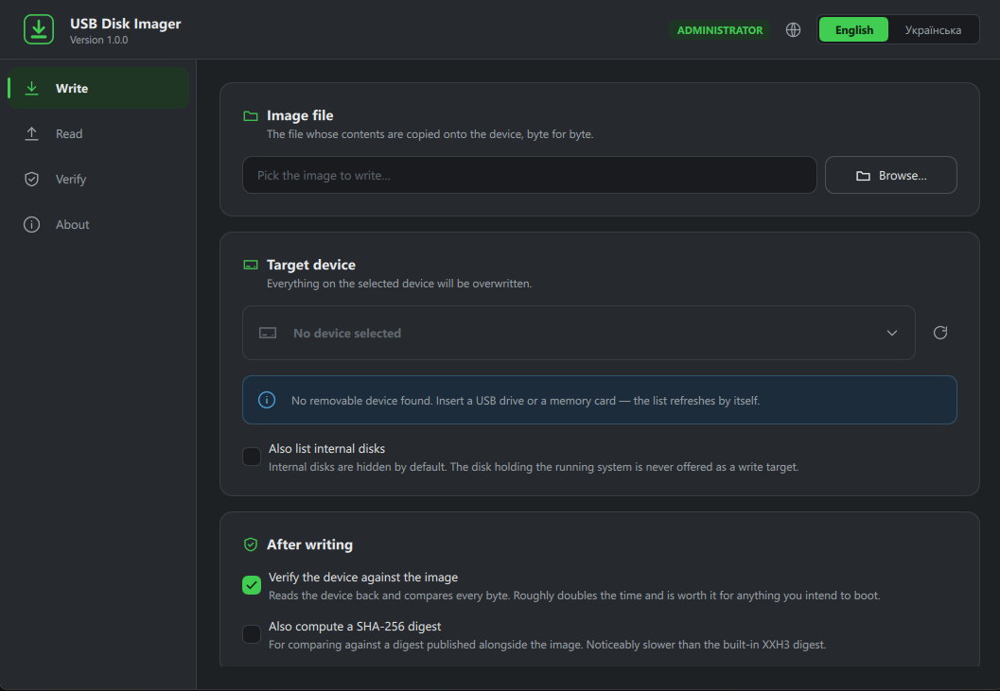

# USB Disk Imager

Modern USB image manipulation program.

USB Disk Imager copies a memory card or a USB drive into a file. It also copies such a file back onto a
card or a drive. That file is called an **image**. It holds every byte of the device, in order, so a
written card boots and works just like the one it came from.

The app is free and open source. One code base runs on Windows 11, on Ubuntu/Debian (x86-64) and on macOS.



## Why another imager

Two well-known tools already do part of this job.

**Win32 Disk Imager** can read a card into a file and write it back. But it only runs on Windows, and it
has not had a new release since 2018. On some computers it freezes the moment you start it. It asks every
drive letter about itself, and if one drive answers slowly, the whole program stops before its window
appears. Drives like encrypted containers, virtual disks and network drives can answer slowly.

**balenaEtcher** is modern and easy to use, but it only writes. It cannot save a card into an image file,
which is what you need to keep a copy of a working system. It is also built on a whole browser engine, so
the download is over 100 MB and it uses a lot of memory. It sends anonymous usage data unless you turn
that off.

USB Disk Imager tries to fix all of that:

- **It reads and writes.** Card to file, and file to card.
- **It never freezes while listing your devices.** Before it opens anything, it checks whether a drive is
  really a part of a physical disk. Virtual and encrypted drives are dropped at that point, so nothing
  slow is ever opened. The check itself opens no drive at all. Listing also runs on a background thread,
  so the window stays alive even if a driver is slow to answer.
- **It can stop reading early.** A 2 GB system on a 32 GB card does not need a 32 GB file.
- **It is small and native.** No browser engine inside, and no telemetry of any kind. Nothing is ever
  sent anywhere.
- **It speaks English and Ukrainian**, and you can switch language while it runs.
- **It is open source** under the MIT licence.

## What it does

### Write

Pick an image file, pick a device, and press **Write to device**. Everything on the device is replaced.

The app will not offer the disk that runs your system as a target. If a card is write protected, it says
so instead of failing halfway. Before it starts, it asks you to confirm, and it shows the device name, its
size and its drive letters, so you can see what you are about to erase.

After writing it can read the device back and compare every byte with the image. This roughly doubles the
time. It is worth it for anything you plan to boot.

### Read, with three ways to stop

Reading copies the device into a new image file. You choose how much to copy:

- **Stop after the last partition.** The app reads the partition table and stops where the last partition
  ends. This is the usual choice.
- **Stop after the last non-empty sector.** The app scans the device backwards from the end and stops at
  the last byte that is not zero. Use this when there is no partition table. It takes a little longer,
  because the device has to be scanned first.
- **Read the whole device.** An exact copy of every sector, empty ones included. The file is always as
  large as the device.

There is a detail here that other tools get wrong. Modern disks use a partition layout called **GPT**, and
GPT keeps a second copy of its partition list at the very end of the disk. If you simply cut the file
short, that second copy is left out, and tools that check the image call it damaged. USB Disk Imager
writes a fresh copy at the new end of the file, with new checksums, and fixes the header at the start to
match. The short image is a correct disk image on its own.

### Verify

Compares a device with an image file, byte by byte, and tells you the exact position of the first byte
that differs. Nothing is written.

### Digests

Every read, write and verify also produces a **digest**: a short code computed from all the bytes that
went past. Two files with the same digest hold the same data. The app always computes a fast digest
(XXH3). You can also ask for **SHA-256**, which is slower, but is the one that image authors usually
publish next to their downloads, so you can compare.

When a read stops early, the digest describes the file that was actually produced, including the rebuilt
GPT parts. So you can check that file later and get the same code.

## Rights you need

Listing devices needs no special rights.

Opening a device to read or write it needs administrator rights on Windows, and root on Linux and macOS.
The app does not fail halfway through: it shows a yellow bar at the top of the page and offers to restart
itself with those rights. On Windows this is the usual UAC prompt. On Linux it uses `pkexec`. On macOS,
start the app from a terminal with `sudo`, because a program restarted through AppleScript loses its
connection to the screen.

On Linux you can also avoid root. `cmake --install` puts a udev rule in place that lets members of the
`disk` group image removable media.

## Building

You need CMake 3.21 or newer, a C++17 compiler, and **Qt 6.8.3 or newer**. That is the version the app is
built and tested against, and CMake stops with an error if it finds an older one. The two other libraries
the app uses (xxHash and spdlog) are downloaded for you while CMake configures the project.

The short way is a preset from [CMakePresets.json](CMakePresets.json). Each preset already points at the
Qt 6.8.3 kit for its platform:

```bat
cmake --preset windows-release
cmake --build build/release
```

On Windows, open a Developer Command Prompt first (or run `vcvars64.bat`), because the presets use Ninja
and MSVC. The presets are `windows-debug`, `windows-release`, `linux-debug`, `linux-release`,
`macos-debug` and `macos-release`. Each one expects Qt 6.8.3 in the place the Qt installer uses by
default; [CMakePresets.json](CMakePresets.json) shows the exact folder per platform. If your Qt is
somewhere else, put your own path in a `CMakeUserPresets.json` file beside it. Git ignores that file.

You can also pass everything by hand:

```bash
cmake -B build/release -DCMAKE_BUILD_TYPE=Release -DCMAKE_PREFIX_PATH=/path/to/Qt/6.8.3/<kit>
cmake --build build/release -j
```

Useful options:

| Option | What it does |
|--------|--------------|
| `-DUDI_USE_SYSTEM_XXHASH=ON` | Use the xxHash your system already has, instead of downloading it |
| `-DUDI_USE_SYSTEM_SPDLOG=ON` | Same for spdlog |
| `-DUDI_WARNINGS_AS_ERRORS=ON` | Turn every compiler warning into an error (this is what CI uses) |

`cmake --install build/release` deploys the program together with the Qt libraries it needs, using
`windeployqt` or `macdeployqt`. On Linux it also installs the desktop entry, the icon, the AppStream
metadata and the udev rule mentioned above.

## Running a build

A fresh build does not carry a copy of Qt, so the Qt libraries have to be findable when the program
starts. On Windows, [`scripts/run-windows.bat`](scripts/run-windows.bat) takes care of that:

```bat
scripts\run-windows.bat            :: run the newest of build\release and build\debug
scripts\run-windows.bat --admin    :: run with administrator rights
scripts\run-windows.bat --qt <your Qt kit> --build-dir build\release
```

It looks for Qt in this order: `--qt`, then `QTDIR`, then a `qmake` on your `PATH`, then the Qt 6.8.3 kit
in the installer's default folder, then the newest kit there. The 6.8.3 kit comes before a newer one on purpose: those are the
libraries the program was linked against. If it has to fall back to another kit, it says so. If the build
already carries its own Qt libraries, it leaves them alone. Run it with `--help` to see all options.

On Linux and macOS, point the loader at your Qt kit instead:

```bash
LD_LIBRARY_PATH=<Qt kit>/lib ./build/release/usb-disk-imager       # Linux
DYLD_FRAMEWORK_PATH=<Qt kit>/lib ./build/release/usb-disk-imager   # macOS
```

## Editing the interface in Qt Design Studio

Open [`usb-disk-imager.qmlproject`](usb-disk-imager.qmlproject) in Qt Design Studio 4.8 or newer. You then
edit the files in [content/](content/) — the very same files the build compiles into the program, so a
change is in your next build. Nothing has to be copied anywhere.

Two things exist only so that this interface can be loaded without the C++ program behind it:

- [`content/qmldir`](content/qmldir) says that `Style` and `Icons` are singletons. The build writes a file
  like this by itself, but a design tool has no build. Without it, both files load as ordinary components
  and every colour comes out empty.
- [designer/](designer/) holds stand-ins for `App`, `Devices`, `Imager` and `Localization`. These four are
  created by C++ when the program starts, and no design tool can create them. The stand-ins have the same
  properties and methods, filled with example values, so each page shows real content instead of blanks.
  None of this is part of the build.

If you give a view model a new property, give its stand-in the same property. Otherwise the design tool
stops drawing whatever uses it.

While you work on a page, these example values are worth changing: set `Imager.busy` to `true` to show the
progress panel, `Imager.hasResult` to `true` to show the result panel (both appear on the page named by
`Imager.operation`), `App.elevated` to `false` to show the rights bar, `Devices.selectedIndex` to `1` to
select the example system disk, and add a line to `Devices.warnings` to show a warning.

Leave Design Studio's CMake generation (`enableCMakeGeneration`) switched off. The CMake files here are
written by hand, and the generator would replace them.

## Translations

The app is written in English. Ukrainian lives in
[`i18n/usb-disk-imager_uk.ts`](i18n/usb-disk-imager_uk.ts). Both are compiled into the program.

```bash
cmake --build build/release --target update_translations   # find new texts in the sources
```

One thing to remember: only the current platform's source files are compiled, so this target only sees
that platform's texts. Run it on Windows, on Linux and on macOS before a release. Otherwise a catalogue
loses entries.

## How the code is arranged

```
configs/    Settings in JSON, one file per subsystem, built into the program and replaceable next to it
content/    The interface: App.qml, the Style and Icons singletons, controls and pages
designer/   Stand-ins for the C++ singletons, so content/ opens in Qt Design Studio
i18n/       Translation files
src/
  app/      Manager scaffolding and JSON config loading
  disk/     Finding devices, raw device access, locking volumes, reading MBR and GPT
            (windows/, linux/, macos/ and unix/ hold the parts that differ per platform)
  imaging/  The read, write and verify engine, and its digests
  managers/ Logging, languages, device scanning, imaging and the interface
  ui/       View models: everything the interface reads
  utils/    CRC32, text formatting, rights, saved user settings
```

The program is one application object that owns a few managers. Each manager is one subsystem. Scanning
devices and imaging each run on their own thread and talk to the interface through queued signals. A
transfer holds its thread from start to end, so **Cancel** works by setting a flag that the copy loop
checks between blocks.

Everything the app does is written to a log file. On Windows it is under
`%LOCALAPPDATA%\Tihran Katolikian\USB Disk Imager\logs`, and the About page has a button that opens the
folder. That log is the first place to look when a card refuses to be written.

If you plan to change the code, [CLAUDE.md](CLAUDE.md) describes the rules this code base follows.

## Licence

MIT. See [LICENSE](LICENSE).

Third-party parts: Qt 6 (LGPL v3), xxHash (BSD 2-Clause), spdlog (MIT).

© 2026 Tihran Katolikian · tkatolikian@outlook.com
